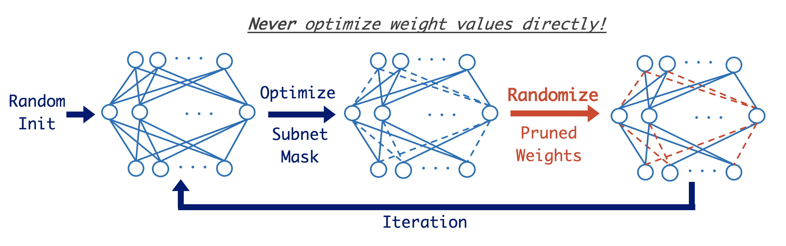

# Pruning Randomly Initialized Neural Networks with Iterative Randomization

by Daiki Chijiwa\*, Shin’ya Yamaguchi, Yasutoshi Ida, Kenji Umakoshi, Tomohiro Inoue

ArXiv: https://arxiv.org/abs/2106.09269



## Requirements

To install requirements (for Python 3.7 & NVIDIA CUDA 10.2):

```setup
pip install -r requirements.txt
```

## Usage
```
python main.py <command> <config> <exp_name>
```

- `<command>` is one of `train`, `test`, and `parallel`. `train` and `test` can be used to train/test single model, and `parallel` can be used to reproduce our experiments or to search hyperparameters.
- `<config>` is the filename of a YAML file. For this, we have `config.yaml`.
- `<exp_name>` is one of the keys defined in the `<config>` file.


## Train Single Model

To train a network, we can simply execute `train` command with `<exp_name>` in `<config>` file.
For example, to train ResNet18 on CIFAR-10 with SGD/edge-popup/IteRand, run the following commands:
```
python main.py train config.yaml cifar10_resnet18_ku_sgd
```
```
python main.py train config.yaml cifar10_resnet18_sc_edgepopup
```
```
python main.py train config.yaml cifar10_resnet18_sc_iterand
```

In the end of experiments, the program automatically evaluate the model on test dataset.

NOTE: We should not use/see this final result for searching hyperparameters. During our research, the final evaluation on test set was conducted only after fixing hyperparamters.


## Reproduce Experimental Results

For each method used in figures in our paper, we provide the corresponding experimental setting as `figure<number>_<hoge>` in `config.yaml`.
We can run the experiments by `parallel` command:
```
python main.py parallel config.yaml figure<number>_<hoge>
```

For example, the results for Conv6 w/ SGD on CIFAR-10 (in Figure 2) is obtained by:
```
python main.py parallel config.yaml figure2_conv6_ku_sgd
```

In the end of experiments, we can check the final results by:
```
python utils/test_info.py __outputs__/figure2_conv6_ku_sgd/ --epoch=99
```

To specify some hyperparameters in `parallel_grid` option in `figure<number>_<hoge>` experiment,
we can use `train` command with command line options like:
```
python main.py train config.yaml figure2_resnet18_sc_iterand --model.config_name=resnet18x0.5 --conv_sparsity=0.6 --rerand_freq=300 --rerand_lambda=0.1 --weight_decay=0.0005 --seed=1
```

